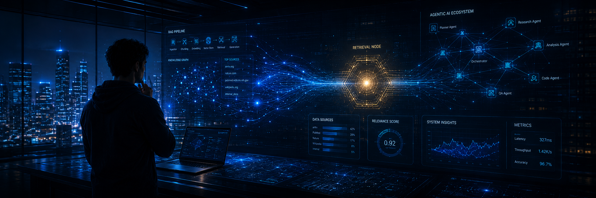

<!-- Banner: 1500x500. Place rendered banner at ./assets/banner.png before pushing. -->

  

<h1 align="center">Aman Pandey</h1>

  <b>AI Systems Engineer</b> &nbsp;·&nbsp; Agentic AI &nbsp;·&nbsp; RAG &nbsp;·&nbsp; Production ML

  <i>MS Data Science @ ASU &nbsp;·&nbsp; GPA 4.0/4.0 &nbsp;·&nbsp; 4+ years production ML &nbsp;·&nbsp; Tempe, AZ</i>

  
  
  
  
  

 

## 🧭 About

> Building AI systems that reason over messy, real-world knowledge — and the boring infrastructure that keeps them honest in production.

MS in Data Science, Analytics & Engineering at **Arizona State University** (GPA 4.0/4.0, Dec 2026), with **4+ years of production experience** shipping NLP pipelines, ML systems, and analytics platforms across SWE, data, and research roles. I care about the boring parts of AI work — evaluation, latency, drift, failure modes — as much as the model itself.

Right now I'm focused on **agentic AI**, **retrieval-augmented generation**, and **robust deep learning**. Open to internships and collaborations on systems that ship.

 

## 🎯 Currently

*A snapshot of what I'm spending time on this quarter.*

| | Track            | Focus                                                                  |
|-|------------------|------------------------------------------------------------------------|
| 🛠 | **Building**    | Agentic RAG patterns — tool-use, query rewriting, and re-ranking       |
| 🔬 | **Researching** | Frequency-domain adversarial robustness in Vision Transformers         |
| 📖 | **Exploring**   | LLM evaluation harnesses, long-context retrieval, MCP, structured outputs |
| 🎯 | **Open to**     | AI/ML Engineering internships — Summer 2026 · *CPT eligible*           |

 

## 💼 Experience

*Where I've shipped real systems with real users.*

### Software Engineer — *My Next Film*
📍 New Delhi, India &nbsp;·&nbsp; 🗓 Apr 2023 – Dec 2024

- Engineered a multilingual NLP pipeline supporting **114 languages** using seq2seq Transformers on AWS (EC2, S3, Lambda) with Google/Azure speech APIs — lifted translation accuracy by **76%** and cut manual review costs.
- Shipped a reviewer web app with automated task allocation — reduced project cycle time by **41%**, improved translation quality by **20%**, and automated **400+** Amazon Polly voice narrations matched to character profiles across markets.

### Data Analyst — *Youth Buzz*
📍 Noida, India &nbsp;·&nbsp; 🗓 Sep 2022 – Mar 2023

- Built churn-prediction models (logistic regression, **84% AUC**) on **50K+** customer records using Python and SQL; RFM clustering identified fee-driven attrition and informed a strategy that cut attrition **50%** in fee-sensitive cohorts within one quarter.
- Boosted Net Promoter Score by **+10** via an analytics-driven strategy; automated survey reporting with zero-shot NLP classification and Power BI dashboards for leadership.

### Software Developer — *Invesca Technology*
📍 Noida, India &nbsp;·&nbsp; 🗓 Dec 2020 – Jul 2022

- Architected Celery/Redis distributed task queues processing **2M+ daily transactions** — reduced pipeline latency by **40%** and held **99.9% SLA** across peak campaigns handling **10×** normal traffic.
- Built log-analytics dashboards and multithreaded Python services that lifted backend throughput by **35%**; automated anomaly-detection alerts to prevent overload incidents.

 

## 🚀 Featured Work

*A handful of projects that show how I think about systems — research-to-production, generative-to-classical.*

### FreqShield-ViT &nbsp;·&nbsp; [Repo →](https://github.com/aman-720/freqshield-vit)
*Frequency-domain adversarial defenses for Vision Transformers.*

**Stack:** `PyTorch` · `DeiT-Small` · `torch-dct` · `PyWavelets` · `SLURM`

Investigation of feature-level frequency-domain regularization for adversarially-trained ViTs across four band-weighting configs and three frequency transforms (DCT, DFT, Haar wavelet). Documents a Siamese collapse failure mode and a threat-model-asymmetric robustness finding. Reproducible pipeline with depth-resolved spectral diagnostics, ablations, and patch-attack evaluation. *Paper in draft.*

---

### GlucoCast
*Generative diffusion framework for blood-glucose forecasting.*

**Stack:** `PyTorch` · `Conditional Diffusion` · `Time-series`

Conditional diffusion model generating privacy-preserving synthetic CGM data conditioned on meals, insulin, and physical activity. **Outperformed LSTM/CNN baselines by 18% RMSE** on the OhioT1DM benchmark.

---

### FinFusion &nbsp;·&nbsp; [Repo →](https://github.com/aman-720/sp500-tft-forecasting)
*Deep learning for S&P 500 return forecasting.*

**Stack:** `PyTorch Lightning` · `pytorch-forecasting` · `ARIMAX` · `LSTM`

Benchmarked ARIMAX, LSTM, and Temporal Fusion Transformer across **450+ experiments** spanning 11 phases. Discovered gradient collapse in financial TFT; weekly resampling achieves **59.1% directional accuracy** across 9-fold rolling evaluation (2016–2024).

---

### Pulse2Symphony
*Biosignal-conditioned music generation on mobile.*

**Stack:** `CNN-LSTM` · `Emotion-conditioned Transformer` · `REMI` · `PPG`

HRV features (SDNN, RMSSD, LF/HF ratio) extracted from smartphone-camera PPG → mood classified into Russell's valence-arousal space via CNN-LSTM → personalized instrumental MIDI generated by an emotion-conditioned Transformer decoder.

---

### Traitlytics &nbsp;·&nbsp; [Repo →](https://github.com/aman-720/Analysing-Personality-from-LinkedIn-Profile)
*Big-Five personality prediction from LinkedIn profile text.*

**Stack:** `BERT` · `RoBERTa` · `TF-IDF` · `FastAPI` · `Docker` · `AWS (EC2)`

NLP pipeline predicting Big-Five personality traits from LinkedIn profile text using BERT and RoBERTa with TF-IDF features. Deployed batch and real-time REST endpoints on AWS.

---

### BasketIQ &nbsp;·&nbsp; [Repo →](https://github.com/aman-720/BasketIQ)
*Market basket analysis on 32.4M Instacart transactions.*

**Stack:** `Python` · `mlxtend (Apriori)` · `scikit-learn` · `Tableau`

Mined Apriori association rules and segmented users into 5 RFM-based clusters via K-Means. Interactive dashboard to drive targeted marketing and retention strategies.

 

## 🛠 Tech Stack

*The tools and frameworks I reach for, organized by what they do.*

#### 🧠 Agentic AI & LLM Systems
- **Frameworks:**  
- **APIs & Models:**  
- **Patterns:**    

#### 🦾 Deep Learning & NLP
- **Frameworks:**    
- **Models:**    
- **Hardware:** 

#### 📊 Data Science & ML
- **Languages:**   
- **Libraries:**    
- **Big Data:** 

#### ☁️ Cloud & MLOps
- **Cloud:**  
- **Containers & Orchestration:**  
- **Serving & Queueing:**   
- **CI/CD:** 

#### 🗄 Data & Storage
- **Databases:**  
- **Warehouses:**  

#### 📈 Analytics & BI
- **BI:**   
- **Plotting:**  

 

## 💬 Let's connect

  Open to conversations about <b>agentic systems</b>, <b>RAG evaluation</b>, and <b>robust ML</b>. 
  If you're building at this intersection — or hiring for it — reach out.

  <a href="https://www.linkedin.com/in/amanpandeyy"><b>LinkedIn</b></a>
  &nbsp;·&nbsp;
  <a href="mailto:amanpandey.ds@gmail.com"><b>Email</b></a>
  &nbsp;·&nbsp;
  <a href="https://amanpandey.ai"><b>Portfolio</b></a>

